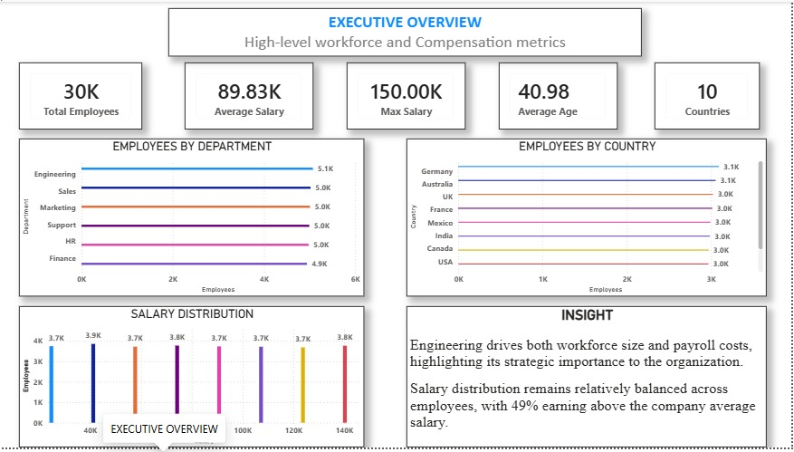
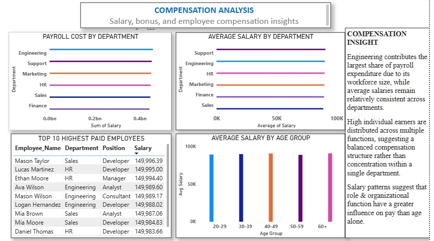
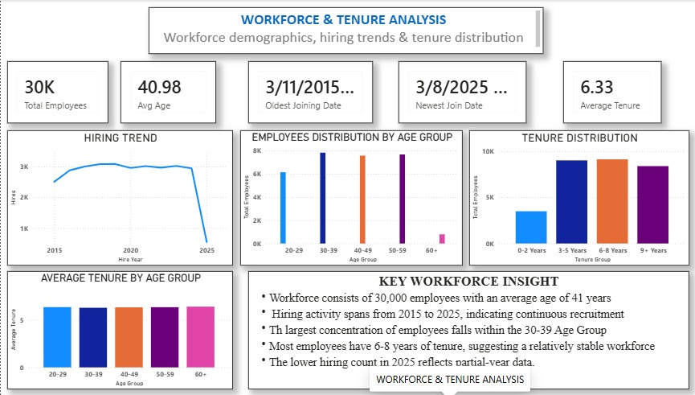

# HR Analytics Dashboard | End-to-End Data Analytics Project

## Project Overview

This project is an end-to-end HR Analytics solution designed to transform raw employee data into meaningful business insights.

The project follows a complete data analytics workflow:

**Python → SQL → Power BI**

Data was cleaned and prepared using Python, analyzed using SQL queries, and transformed into an interactive Power BI dashboard to help HR teams understand workforce trends, compensation patterns, employee demographics, and organizational performance.

# Business Objectives

The main objectives of this project were to answer key HR questions:

- How many employees does the organization have?
- Which departments have the highest workforce concentration?
- What is the average and highest salary?
- Which departments contribute the highest payroll cost?
- What are the employee age and tenure distributions?
- How has employee hiring changed over time?
- What countries have the highest employee representation?

# Tools & Technologies

| Tool | Purpose |
|---|---|
| Python | Data cleaning, transformation & exploratory analysis |
| Pandas | Data manipulation |
| SQL | Data analysis, aggregations & business queries |
| Power BI | Dashboard development & visualization |
| DAX | Measures and calculations |
| Excel | Data validation |

# Data Analytics Process

## 1. Data Cleaning & Preparation (Python)

Performed data preparation tasks including:

- Handling missing values
- Checking data types
- Creating calculated columns
- Preparing data for database analysis

Key Python libraries used:

- Pandas
- NumPy
- Matplotlib

## 2. Data Analysis (SQL)

Used SQL to generate business insights through:

- SELECT statements
- Filtering
- GROUP BY analysis
- Aggregations
- Window functions
- Views
- Stored procedures

Examples of analysis performed:

- Employee count by department
- Salary distribution analysis
- Payroll calculation
- Hiring trends
- Employee tenure analysis

# Power BI Dashboard Pages

## 1. Executive Overview

Provides a high-level view of organizational performance.

Key KPIs:

- Total Employees: 30,000
- Countries: 10
- Average Salary: 89,826
- Average Employee Age: 41 years

## 2. Compensation Analysis

Analyzes salary structures and payroll distribution.

Insights:

- Engineering has the largest workforce.
- Sales contains some of the highest-paid employees.
- Payroll costs vary significantly across departments.

## 3. Workforce & Tenure Analysis

Explores employee demographics and retention patterns.

Analysis includes:

- Age groups
- Employee tenure
- Hiring trends
- Joining year analysis

# Key Insights

Some important findings from the analysis:

✅ Engineering is the largest department with over 5,000 employees.

✅ Approximately 49% of employees earn above the average salary.

✅ The organization has employees distributed across 10 countries.

✅ Employee hiring trends show workforce growth over time.

✅ Tenure analysis helps identify workforce stability and retention patterns.

# Dashboard Preview

## Executive Overview

## Compesation Analysis

## Workforce & Tenure Analysis

# Skills Demonstrated

- Data Cleaning
- Exploratory Data Analysis
- SQL Analytics
- Data Modeling
- DAX Measures
- Dashboard Design
- Business Intelligence Reporting
- Storytelling with Data

# Author

**Handerson Mtakai**

Data Analyst | Excel | SQL | Python | Power BI

Passionate about transforming data into actionable business insights.

# If you find this project useful

Feel free to explore the repository and connect with me.